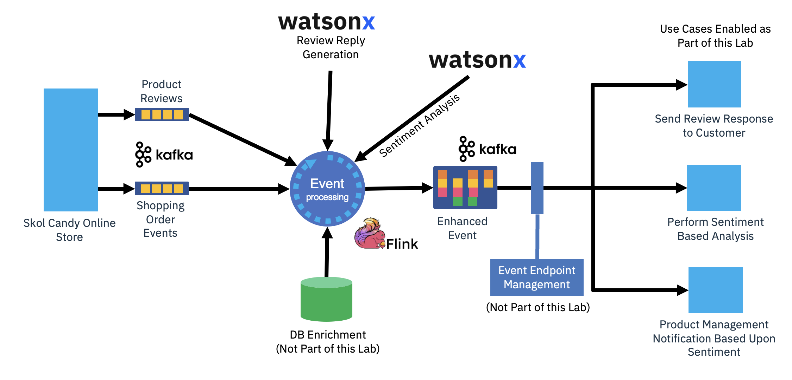

# Welcome to Skol Candy

{ width=40% align=right }

Skol Candy is an online general store specializing in treats and goodies.  The store has added an Event Automation backend that enables that help promote the agile development of features and modern operational practices.  As a customer, your experience includes being able login and order items for delivery.  You are also encouraged to leave product reviews.  As part of this lab, you will first explore this online shopping experience.  Next, you will work with the application's backend to enable new analytic and customer experience opportunities.

The steps you will perform:

- Purchase from the Skol Candy e-Tail experience
- Explore events being produced into the backend
- Build a event processing flow that processes the events into your own topic
- Use an AI processing node to provide sentiment analysis against customer produced product reviews
- Use an AI node to create AI generated response content targeted to the customer reviewer

Event Automation Flow:

{width=80%}